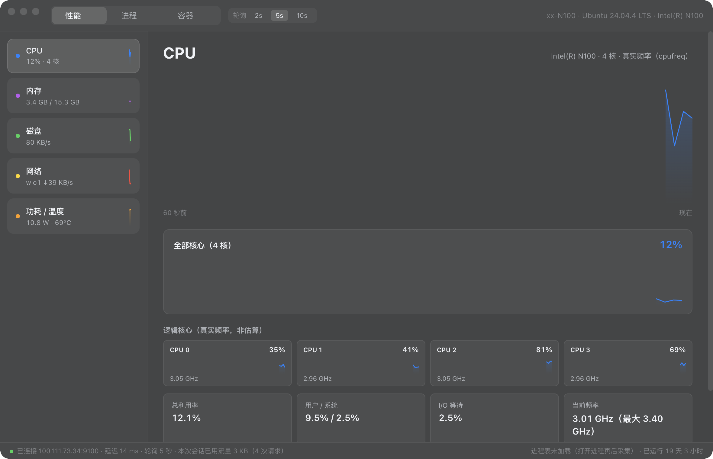
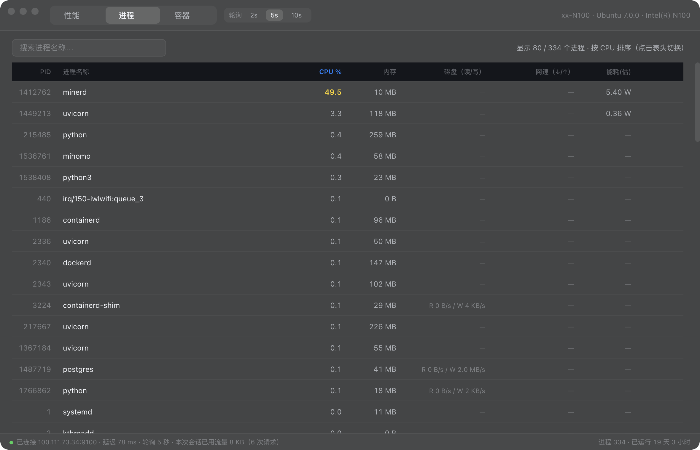
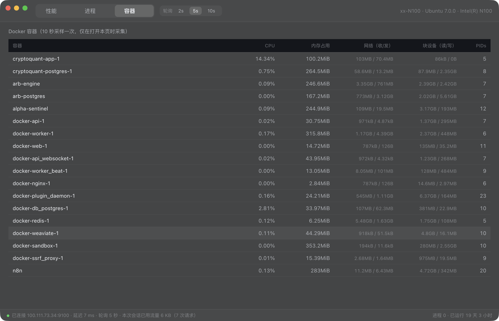

# 任务管理器-N100（mac-task-manager-n100）

在 Mac 上实时远程监控 **N100（Ubuntu 24.04）** 的任务管理器，界面与交互复用 [mac-task-manager](https://github.com/zsan189312-sys/mac-task-manager)（任务管理器-本机）的 macOS 原生风格。

## 预览

**性能页** — 4 核实时占用 + **真实频率**（cpufreq，非估算）：



**进程页** — 全量进程 + 磁盘读写 + 每进程网速 + 能耗瓦数：



**容器页** — Docker 容器级 CPU / 内存 / 网络 / 块设备：



## 架构

```
Mac（Electron）──HTTP/gzip──▶ N100 agent（Python 标准库，systemd 常驻）──▶ /proc + /sys + docker
```

- **N100 端**：`agent/n100_agent.py`，零第三方依赖，绑定 Tailscale 地址 `100.111.73.34:9100`，后台 1 秒采样 CPU/磁盘/网络/RAPL 功耗，进程表与 Docker **按需采样**（没人看就不采）
- **Mac 端**：Electron 轮询 agent，响应 gzip 压缩；会话内自动统计已用流量并在状态栏实时显示

## 省流量设计（实测）

| 指标 | 数值 |
|---|---|
| 单次系统快照（线上字节，gzip 后） | **约 1.8 KB** |
| 默认轮询 5 秒 → 每小时 | ~1.3 MB |
| 24 小时挂机 | **~30 MB** |
| 进程表（按需，仅进程页打开时） | ~1 KB/次 |

顶栏可切换 2s / 5s / 10s 轮询档位（持久化保存）。

## 功能

- **CPU**：每核占用 + 真实频率 + 负载均值 + I/O 等待
- **内存**：物理内存构成（匿名/缓存/共享/缓冲）、Swap
- **磁盘**：块设备读写速率（自动排除分区重复计数与 loop 设备）、挂载点容量
- **网络**：物理网卡 / Wi-Fi / Tailscale（自动排除 veth/br-* 虚拟接口）
- **功耗 / 温度**：Intel **RAPL 真实功耗**（封装 + 核心，瓦）+ CPU/主板/无线温度
- **进程**：全量进程、整机占比 CPU、内存、**进程级磁盘读写**（/proc/pid/io）、**每进程 TCP 网速**（ss 解析）、能耗（整机功耗 × CPU 份额）、搜索/排序/远程结束进程
- **容器**：Docker 容器 CPU/内存/网络/块设备/PIDs（10 秒采样，仅打开该页时采集）

## 部署

### 1. N100 端（一次性）

```bash
cd agent && ./deploy.sh n100     # scp + systemd 常驻（root 运行以读 RAPL 与全部进程 io）
```

### 2. Mac 端

```bash
cd app && ./build.sh             # 复用本机版项目的 Electron，构建并安装到 /Applications
```

## 安全说明

- agent 只监听 Tailscale 网卡（`N100_BIND=100.111.73.34`），不暴露到局域网/公网
- `/api/kill` 可远程结束进程——tailnet 内所有设备均可调用，如需收紧可在 agent 设 `N100_TOKEN` 环境变量并在请求头带 `X-Token`
